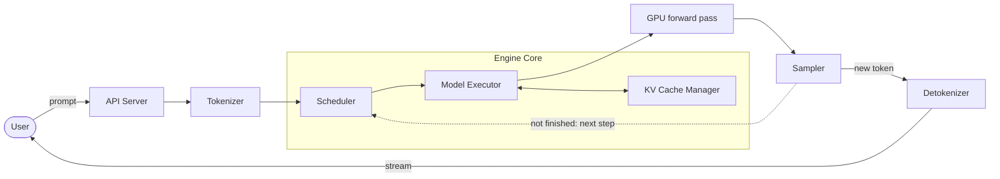
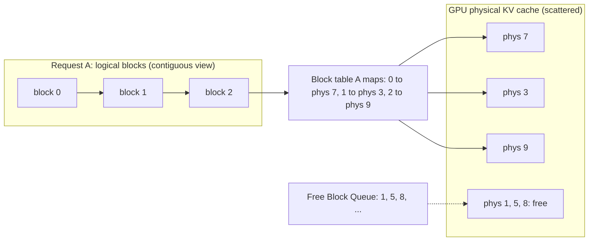

# Inference Engineering — field notes

Learning inference engineering in public. This repo is where I write down how modern LLM **serving** actually works — in my own words, with diagrams I can reason from rather than just nod at.

I build products *with* AI, not models from scratch. These notes are me pulling the lid off the serving layer so I understand the cost curve, the latency knobs, and the systems design underneath the APIs I ship on.

> **Note 01 was prompted by [@maxxfuu](https://x.com/maxxfuu)'s Inference Engineering series — Day 11/90 ([tweet + animation](https://x.com/maxxfuu/status/2078056064906658113)).** His post is what sent me down the rabbit hole. The explanation and diagrams below are my own; corrections and PRs welcome.

## Notes in this series

- **Note 01 — How vLLM works** (below) — inference-engine internals: PagedAttention, continuous batching, the KV cache manager.
- **[Note 02 — KTransformers, ELI5: a 671B model on one gaming GPU →](./ktransformers-eli5.md)** — CPU/GPU hybrid inference for giant Mixture-of-Experts models.

**Related repo:** [Agent Swarms for Multi-Angle Analysis →](https://github.com/wilsonwu-ai/agent-swarms)

---

## Note 01 — How vLLM works, and why it matters if you build *with* AI

[vLLM](https://github.com/vllm-project/vllm) is an open-source **inference engine**: it takes a trained model's weights and turns them into a service that answers thousands of concurrent users quickly and cheaply. A model checkpoint is inert. Serving it well — high throughput, low latency, tight memory — is a *separate systems problem*, and that problem is the entire reason engines like vLLM exist.

### First, why this is hard

Two facts about text generation shape every design decision:

1. **Decoding is autoregressive.** During generation the model emits **one token at a time**, and each new token attends to every token before it. Step *t+1* literally needs step *t*'s output, so you cannot parallelize a single sequence across time. *(Prefill — ingesting your prompt — is one parallel forward pass. It's the decode loop that's inherently serial.)*
2. **Decode is memory-bandwidth-bound, and the KV cache is the capacity limit.** To avoid recomputing attention over the whole prefix every step, the engine caches the **key and value vectors for every past token** — the **KV cache**. Two consequences fall out of that. First, every decode step streams the full model weights (plus the growing KV cache) from HBM just to emit one token per sequence, so the GPU's compute mostly sits idle waiting on memory — decode is *bandwidth*-bound (prefill, by contrast, is compute-bound). Second, the KV cache — which grows with sequence length **and** with concurrent requests — is the **capacity** bottleneck that caps how many users fit on the GPU at once.

So the whole game is: **keep the GPU busy (throughput) without making any single user wait (latency), while spending KV-cache memory as efficiently as possible.** vLLM is essentially three answers to three questions.

### The big picture: one request's journey



A request is tokenized, handed to the **Engine Core**, and joins a pool of in-flight requests. Every step, the **Scheduler** picks who runs, the **Model Executor** runs them on the GPU, the **KV Cache Manager** hands out and tracks the memory their attention needs, a token is sampled and streamed back — and unfinished requests loop right back into the next step. The three subsystems map cleanly onto three questions:

| Subsystem | Question it answers |
|---|---|
| **Scheduler** | *Which* requests run next? |
| **Model Executor** | *How* does a batch actually execute on the GPU? |
| **KV Cache Manager** | *Where* does each request's KV cache live? |

---

### 1. The Scheduler — *which* requests run (continuous batching)

The naive way to serve is **static batching**: collect N requests, run them all until the *last* one finishes, then start the next batch. The problem is stragglers. One user asking for a 2,000-token essay holds the whole batch hostage while nine users who wanted 20-token answers sit finished — and the GPU burns cycles on a batch that's mostly padding.

vLLM uses **continuous batching** (a.k.a. iteration-level / in-flight batching): the scheduler re-decides the batch **every single decode step**. Finished requests drop out immediately and free their slots; waiting requests join mid-flight. The GPU stays **busy** — no slot sits idle waiting for the batch to drain.

Here's the same batch of 4 slots across a few steps — watch requests leave and join without waiting for the batch to drain:

| Step | Slot 1 | Slot 2 | Slot 3 | Slot 4 |
|------|--------|--------|--------|--------|
| t0 | A (decode) | B (decode) | C (decode) | D (decode) |
| t1 | A | B | **C finishes → freed** | D |
| t2 | A | B | **E joins** | D |
| t3 | **A finishes → freed** | B | E | D |
| t4 | **F joins** | B | E | D |

That single idea — schedule at the *iteration* level, not the *request* level — is a big part of why hosted inference is so much cheaper than naive serving. The scheduler also handles admission under a **memory + token budget**, splits long prompts with **chunked prefill** so a big prefill doesn't stall everyone's decode, and **preempts** requests when the GPU runs out of KV blocks — in V1 it frees their blocks and **recomputes** the KV when the request resumes (cheap when prefix caching still holds the shared prefix); V0 could also swap KV out to CPU.

---

### 2. The KV Cache Manager — *where* the KV lives (PagedAttention)

This is vLLM's headline idea, and it's borrowed straight from operating systems.

The naive KV cache reserves one **contiguous** buffer per request, sized for the *maximum* possible length. That wastes enormous memory: a request that generates 30 tokens still holds a 2,048-token reservation, and the leftover holes are too fragmented to reuse. Low usable memory → small batches → poor throughput.

**PagedAttention** treats the KV cache like **virtual memory**. It's chopped into fixed-size **blocks** (e.g. 16 tokens each). A request's KV cache is just a *set of blocks* that don't have to be contiguous in GPU memory, tied together by a per-request **block table** — the exact analog of an OS page table mapping virtual pages to physical frames.



The manager keeps a **Free Block Queue** — a host-side list of which physical blocks are currently unused. When a request needs more room, the manager **pops a free block** and points the block table at it. No scanning GPU memory for a gap; allocation is O(1). Fragmentation collapses to *at most one partially-filled block per sequence*.

Two payoffs fall out of the paging design almost for free:

- **Prefix sharing / copy-on-write.** If two requests share a prefix (same system prompt, or parallel samples of one prompt), their block tables can point at the *same* physical blocks until one diverges. This is the mechanism behind **prefix caching** — and it's a big deal for real apps (more below).
- **KV waste drops to under ~4%** (versus 60–80% with contiguous max-length reservation), which directly means larger batches and higher throughput on the same GPU.

---

### 3. The Model Executor — *how* a step runs

Given the scheduler's chosen batch, the executor does the mechanical work of one forward pass:

```mermaid
sequenceDiagram
    participant S as Scheduler
    participant M as Model Executor
    participant K as KV Cache Manager
    participant G as GPU
    loop every decode step
        S->>K: need space? pop block(s) from free queue
        S->>M: run this batch (+ block tables & metadata)
        M->>G: forward pass — writes each token's K,V into its block (slot mapping)
        G-->>M: logits
        M->>M: sample next token per request
        M-->>S: tokens out; finished requests free their blocks
    end
```

It gathers the input tensors and metadata (token positions, each request's **block table**, the slot mapping that says where new K/V get written) and launches the fused attention kernels (the PagedAttention kernel reads the scattered blocks; FlashAttention-style kernels keep it fast). The kernel **writes each processed token's key/value into its assigned block *during* the forward pass** — that write is what the *next* step attends to, not a consequence of sampling. Then it computes logits, samples the next token per request, and returns tokens for streaming. The loop turns again.

---

### The current architecture (vLLM V1)

The 2025 **V1** rewrite hardened all of this for production. The headline change: the **Engine Core runs in its own process**, isolated from the API server, tokenization, and detokenization. The GPU's tight scheduler↔execute loop no longer shares a thread with HTTP handling, so those overheads stop stealing GPU time. Scheduling is **overlapped with GPU execution** (async) so it no longer stalls the decode loop, **prefix caching is on by default**, and prefill/decode are unified into one scheduler that mixes them in a single batch. Same three subsystems — just a cleaner, faster spine.

---

## What this taught me about AI engineering

I'm not training these models. I'm going to *build products on top of them* — RAG systems, agents, customer-facing features. Here's why the internals still earn their rent:

- **KV cache is your real capacity curve.** Not the parameter count — the *cache*. Long contexts and high concurrency are what fill GPU memory and force you onto bigger, pricier instances. If your feature quietly grows its context window, you just moved your infra bill, and now I know *why*.
- **Prefix caching turns shared prompts into a serving optimization.** Agentic and RAG apps resend the *same* giant system prompt on every call. On a cache **hit**, vLLM reuses the KV blocks of that shared prefix instead of recomputing them — so a stable, front-loaded prefix pays off. The catch: the cache is best-effort and evicts under memory pressure (exactly when load is highest), so design *for* it, don't assume it. Still, it reframes prompt design as a *performance* decision, not just a style one.
- **Throughput and latency are a dial, not a number.** Bigger batches raise tokens/sec (cheaper per token) but can raise per-user latency. The metrics users actually feel are **TTFT** (time to first token) and **inter-token latency** — not aggregate throughput. A streaming chat UI lives or dies on TTFT; a bulk-processing job optimizes throughput. Same engine, opposite tuning.
- **The systems patterns generalize.** Paging to beat fragmentation. Iteration-level scheduling to beat head-of-line blocking. Moving the hot loop into its own process. These are classic OS and distributed-systems ideas *retargeted* at model serving — which is exactly the ground an AI engineer stands on: systems design meeting the model.
- **Know the knobs before you reach for more GPUs.** Half the "we need a bigger box" problems are really "we left throughput on the table."

### The knobs I'd actually reach for

| Knob | What it buys |
|---|---|
| `--gpu-memory-utilization` | How much VRAM to hand the KV cache (bigger → larger batches; defaults to 0.9 for headroom) |
| `--max-num-seqs` / `--max-num-batched-tokens` | The throughput ↔ latency dial |
| `--enable-prefix-caching` | Reuse shared-prompt KV across requests on a cache hit (default-on in V1) |
| chunked prefill | Stops long prompts from stalling everyone's decode |
| quantization — weights (FP8 / AWQ / GPTQ) + KV cache (`--kv-cache-dtype fp8`) | Smaller weights free VRAM for more KV blocks; KV-cache quant shrinks the cache entries directly |
| speculative decoding | A small draft model proposes tokens; the big model verifies in parallel |

---

## Credits & further reading

- **Prompt & animation:** [@maxxfuu](https://x.com/maxxfuu) — Inference Engineering, Day 11/90 ([tweet](https://x.com/maxxfuu/status/2078056064906658113)).
- **The paper:** Kwon et al., *Efficient Memory Management for Large Language Model Serving with PagedAttention*, SOSP 2023.
- **The code & docs:** [vllm-project/vllm](https://github.com/vllm-project/vllm) · [docs.vllm.ai](https://docs.vllm.ai).

*Field notes by [Wilson Wu](https://www.linkedin.com/in/wilson1wu/) — operator learning to build with AI. Prose is mine and may be wrong in the fun ways; open an issue if you spot something. Licensed [CC BY 4.0](https://creativecommons.org/licenses/by/4.0/).*
