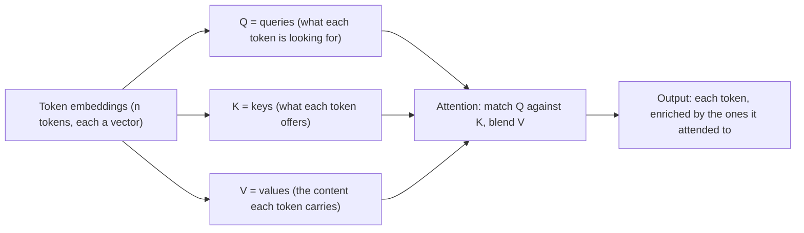
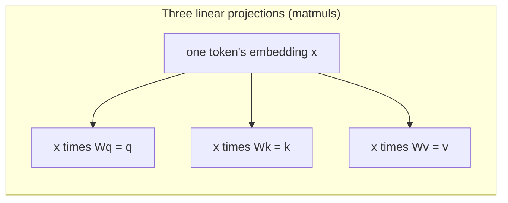
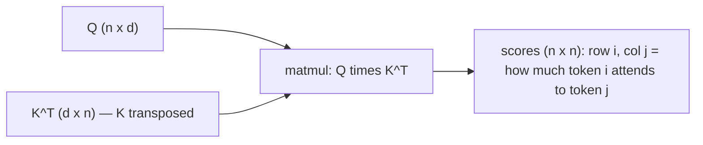
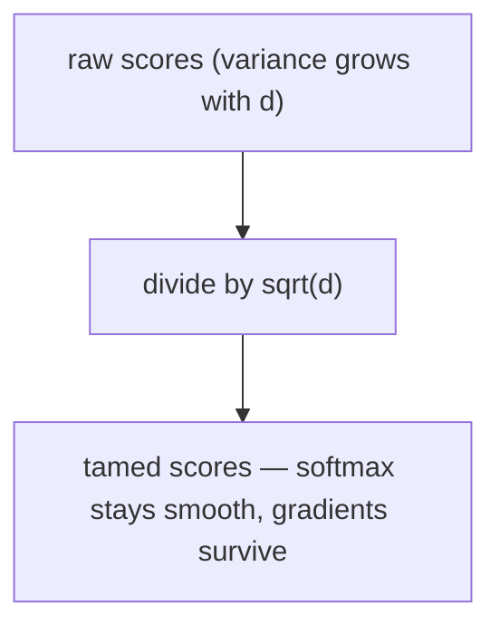
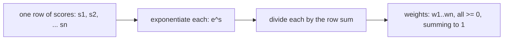
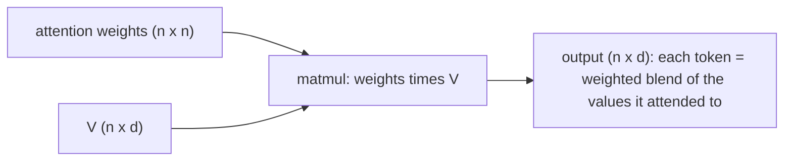
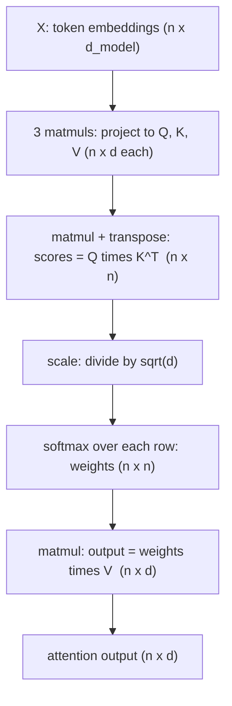

# Note 03 — Attention from scratch, ELI5: it really is just 4 operations

**[← back to the series](./README.md)**

There's a claim that sounds too good to be true: the **attention mechanism** — the thing at the heart of every LLM — is, at its core, *just four operations you already know*:

1. **Matrix multiplication**
2. **Transpose**
3. **Scaling** (divide by a number)
4. **Softmax**

It's true. You can implement scaled dot-product attention in **plain C, in ~100 lines, with no autograd and no libraries** — just nested loops over those four ops. And doing it once teaches you more than hours of reading, because you *see* that there's no magic. This note is the ELI5 of what those four operations actually compute, with the diagrams I'd draw on a whiteboard.

> Prompted by [@v0xium](https://x.com/v0xium)'s "attention from scratch in C" post ([the clip](https://x.com/v0xium/status/2078051464375853318/video/1) is on X, which is login-gated, so I worked from the posted breakdown). The math is standard **scaled dot-product attention** (Vaswani et al., *Attention Is All You Need*, 2017); the explanations and diagrams are my own.
>
> **Series cross-links:** this is the primitive that [Note 01's PagedAttention](./README.md) *optimizes the memory access of*, and the exact scores that [Kimi's QK-Clip](https://github.com/wilsonwu-ai/scaling-open-models) clips when they blow up at trillion-parameter scale.

---

## The one-sentence idea

Attention lets every token **look at every other token and mix in the ones that matter.** "The animal didn't cross the street because *it* was tired" — to resolve "it," the model needs the token *it* to attend to *animal*. Attention is the machinery that lets it.

Mechanically: each token asks a **question** (a *query*), every token advertises a **label** (a *key*), and every token carries **content** (a *value*). You match queries against keys to decide *who to listen to*, then pull in a weighted blend of their values.



Q, K, and V are just your input run through **three learned weight matrices** — three matrix multiplies. That's the "before" step; then the four headline operations do the rest.



---

## The four operations, one at a time

Say we have `n` tokens, each turned into a query/key/value vector of length `d`. Stack them into matrices **Q, K, V**, each shaped `n x d`.

### Operation 1 + 2 — matmul and transpose: the score matrix

To find out how much token *i* should attend to token *j*, take the **dot product** of query *i* with key *j*. Do it for *every* pair at once with a single matrix multiply — and that's where the **transpose** comes in: you multiply `Q` by `K` *transposed*.



Why transpose? Matrix multiply needs the inner dimensions to match. `Q` is `n x d`; to dot every query with every key you need `K` as `d x n`, so `Q (n x d) · Kᵀ (d x n) = scores (n x n)`. The result is an **`n x n` grid** — one score for every (query, key) pair. That single `QKᵀ` is operations 1 and 2 together.

> ELI5: it's an `n x n` scoreboard. Cell (i, j) = "how relevant is token *j* to token *i*?"

### Operation 3 — scaling: keep the numbers sane

Those raw dot products get **big** as the vector length `d` grows (you're summing `d` products, so their variance scales with `d`). Feed big numbers into softmax and it **saturates** — one weight goes to ~1, the rest to ~0. The leading explanation (from the original paper, where it's stated as a *suspicion*, not a proof) is that this pushes softmax into a region of tiny gradients, so learning slows. The fix is one division: **scale every score by `1 / √d`.**



That's it — the whole "scaling" step is `scores / sqrt(d)`. (This is the same "attention logits explode" failure mode that, at trillion-parameter scale, needs a stronger governor — see [QK-Clip in the Kimi note](https://github.com/wilsonwu-ai/scaling-open-models).)

### Operation 4 — softmax: turn scores into weights

Now turn each **row** of the score grid into a set of **weights that sum to 1** — a probability distribution over "who to listen to." That's softmax, applied per row:



`softmax(sᵢ) = e^{sᵢ} / Σ e^{sⱼ}`. (In real code you subtract the row max before exponentiating so `e^s` doesn't overflow — the one numerical-stability trick every from-scratch implementation needs.)

### The payoff — weighted sum of values (one more matmul)

The weights say *how much* to listen to each token. Multiply them by **V** to actually pull in that content: one more matrix multiply, `weights (n x n) · V (n x d) = output (n x d)`.



Each output row is a **blend of the value vectors**, weighted by attention. Token *it* ends up mostly made of *animal*'s value. Done.

---

## The whole thing on one page



Read the labels top to bottom and you've read the formula every paper writes as one line:

> **Attention(Q, K, V) = softmax( Q·Kᵀ / √d ) · V**

Four core operations (matmul, transpose, scale, softmax), bookended by the three projection matmuls that make Q/K/V. That's the entire mechanism.

---

## What "in C" actually looks like

No framework, no autograd — just loops. Here's the shape of it (illustrative, not copy-paste):

```c
// scores = Q * K^T, then scale
for (int i = 0; i < n; i++)          // for each query
  for (int j = 0; j < n; j++) {      // against each key
    float dot = 0.0f;
    for (int t = 0; t < d; t++)      // dot product over the vector
      dot += Q[i][t] * K[j][t];      // K[j][t] IS K^T[t][j] — the transpose is free
    scores[i][j] = dot / sqrtf(d);   // the scaling step
  }

// softmax over each row (subtract row max for numerical stability), then * V
for (int i = 0; i < n; i++) {
  softmax_inplace(scores[i], n);     // op 4
  for (int t = 0; t < d; t++) {      // output = weights * V
    float acc = 0.0f;
    for (int j = 0; j < n; j++)
      acc += scores[i][j] * V[j][t];
    out[i][t] = acc;
  }
}
```

Notice the transpose never even gets materialized — indexing `K[j][t]` instead of `K[t][j]` *is* the transpose. That's the whole trick people mean by "attention is just 4 operations": at the C level they're a handful of nested `for` loops.

**Honest footnote so you're not surprised later:** this is *single-head* attention (where the head dimension equals `d`, so `√d` is exactly the paper's `√d_k`), and I left out two things a production layer adds — **causal masking** (set scores to `-inf` for future tokens so a token can't attend ahead, then softmax) and **multi-head** (run `h` of these in parallel on `d/h`-sized slices — so each head scales by `√(d/h)` — then concatenate and apply one more output projection `Wᴼ`). Both are cheap additions on top of the same four operations — a masking step before softmax, and a loop over heads. The core is exactly what's above.

---

## Why this matters if you build *with* AI

I build products on top of models, and implementing attention once changed how I read the whole stack:

- **The kernels aren't magic — they're memory tricks over this exact math.** [FlashAttention (used in Note 01)](./README.md) computes *these same four operations* but **never writes the giant `n x n` score matrix to slow memory** — it tiles and fuses the steps. ([PagedAttention](./README.md), the other Note 01 idea, attacks a *different* cost — it pages the KV cache to kill memory fragmentation.) Once you've seen the naive `n x n` grid, you understand *why* memory, not math, is the bottleneck.
- **The `n x n` score matrix is the quadratic cost everyone fights.** Its size grows with the square of the sequence length — that single grid is why long context is expensive, why the KV cache exists (so you don't recompute past keys/values every step), and why linear-attention variants like [Kimi Delta Attention](https://github.com/wilsonwu-ai/scaling-open-models) try to *avoid* forming it at all.
- **"The logits explode" is a real, visible failure — right here at Operation 3.** The scaling step is a mild governor; at frontier scale you need a stronger one. Seeing where the scores live makes the [Kimi QK-Clip](https://github.com/wilsonwu-ai/scaling-open-models) fix legible instead of mysterious.
- **Fluency beats reverence.** Knowing attention is four loops means I reason about cost and behavior from first principles instead of treating the model as a black box. That's the difference between *using* an API and *engineering* on top of one.

---

## Credits & further reading

- **Prompt:** [@v0xium](https://x.com/v0xium) — "Attention Mechanism from scratch in C."
- **The paper:** Vaswani et al., *Attention Is All You Need*, NeurIPS 2017 (the `softmax(QKᵀ/√d)V` formula).
- **The fast version:** Dao et al., *FlashAttention* — the same math, IO-aware. See [Note 01 — vLLM](./README.md) for how it's used in serving.
- **Related:** [Note 04 — CUDA Graphs](./cuda-graphs.md) · [How Kimi scales open models](https://github.com/wilsonwu-ai/scaling-open-models).

*Field note by [Wilson Wu](https://www.linkedin.com/in/wilson1wu/) — operator learning to build with AI. ELI5 and diagrams are mine, grounded in the original paper; the C sketch is illustrative. Corrections welcome. Licensed [CC BY 4.0](https://creativecommons.org/licenses/by/4.0/).*
