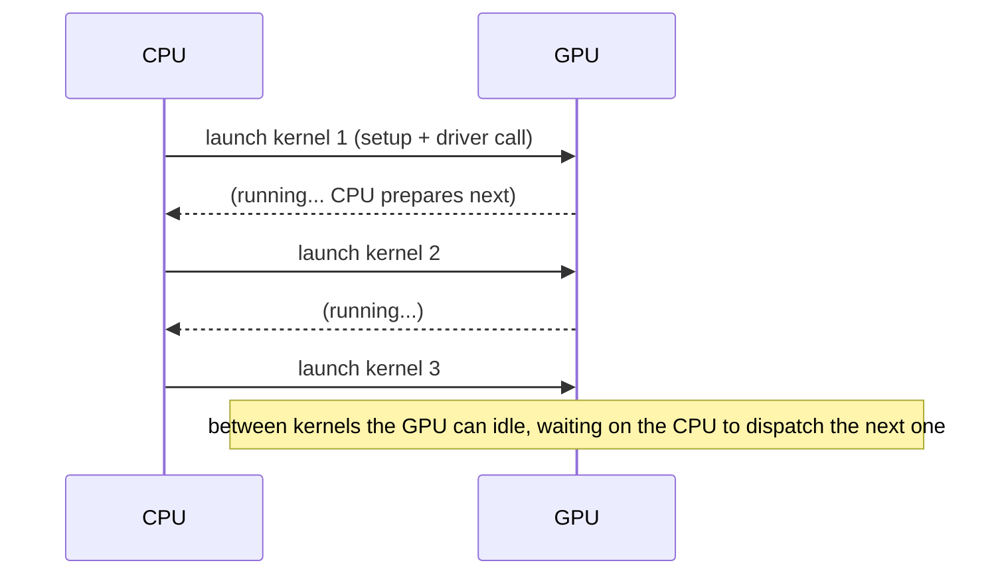
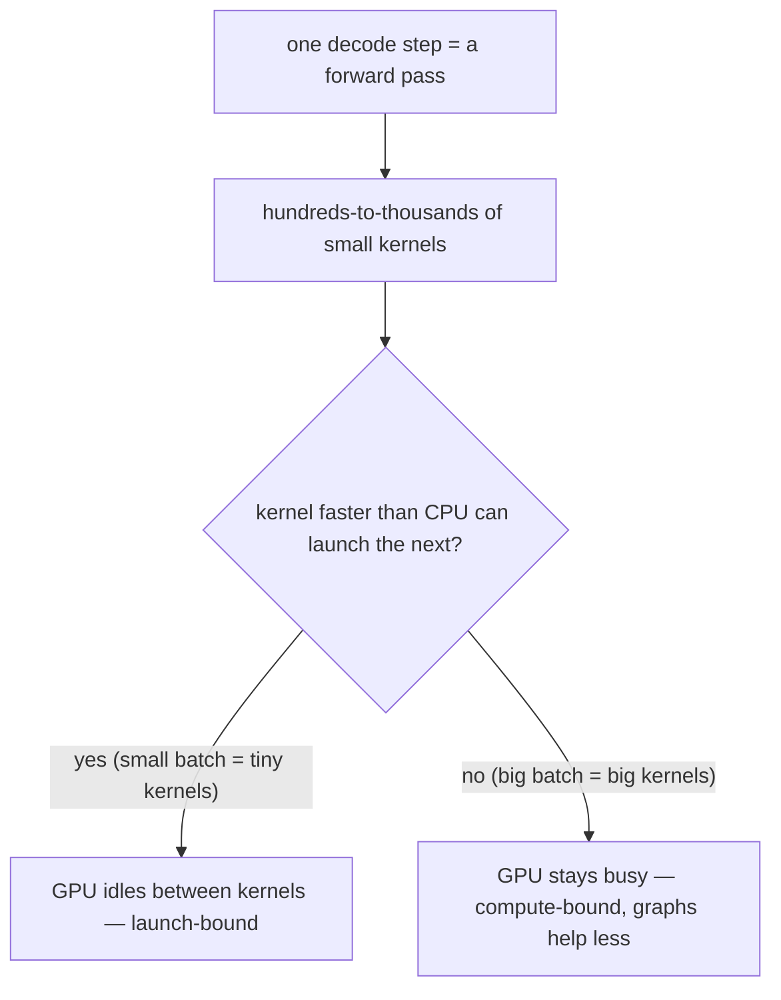
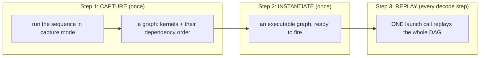
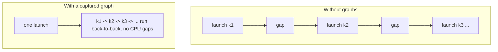
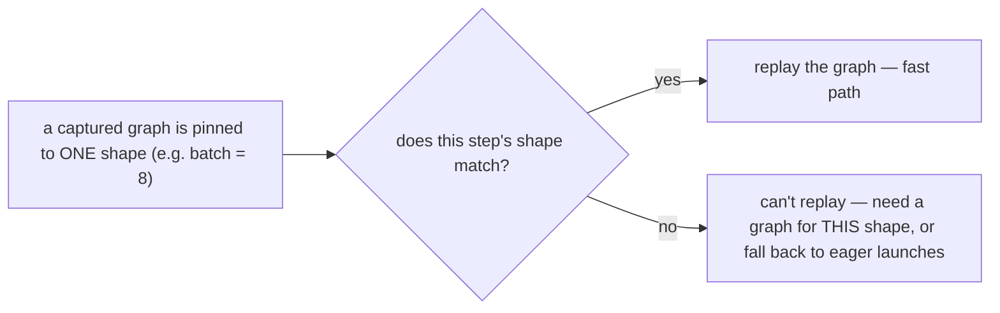
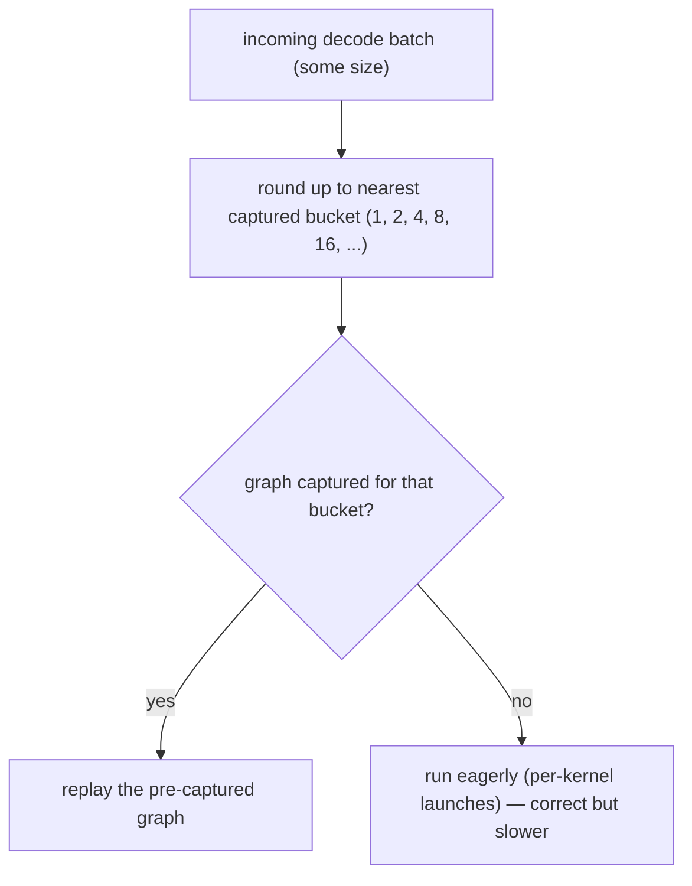
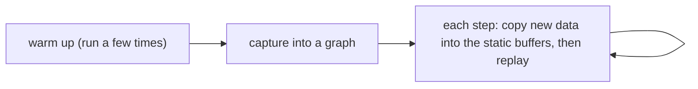

# Note 04 — CUDA Graphs, ELI5: stop paying the launch tax on every kernel

**[← back to the series](./README.md)**

In [Note 01](./README.md) we saw that LLM **decode** is a tight loop: every token, the GPU runs a forward pass and emits one token. What that note glossed over is *how many* separate GPU operations one forward pass is — **hundreds to thousands of tiny kernels** in a naive, unfused pass (one or more per layer, per operation; kernel fusion cuts the count, and CUDA Graphs attack whatever remains). And here's the catch nobody mentions until they profile: at the small batch sizes decode runs at, the GPU often **sits idle waiting for the CPU to launch the next kernel.** The compute is cheap; the *launching* is the tax.

**CUDA Graphs** are how you stop paying it. This note is the ELI5 of what they do and why every serious serving stack (vLLM included) turns them on.

> Prompted by an "Inference Engineering, day 1: CUDA Graphs" post pointing at NVIDIA's intro to CUDA Graphs and PyTorch's CUDA Graphs overview. Explanations and diagrams are my own, grounded in those public docs.
>
> **Series cross-links:** this makes the [decode loop from Note 01](./README.md) cheap; it's one of the "V1 hardened this for production" details underneath vLLM.

---

## The problem: launching a kernel isn't free

A **kernel** is one function that runs on the GPU (a matmul, a softmax, an add). To run one, the **CPU** has to do work first: call the driver, set up arguments, and queue the launch. That CPU-side cost is small — microseconds — but it's **per kernel**, and the CPU pays it. Launches are *asynchronous* — the CPU queues them ahead and the GPU pulls from the queue — so normally the GPU stays fed. It only **starves** when the kernels finish faster than the CPU can refill the queue (exactly the decode case, below).

One kernel? The overhead is invisible. But a single decode step fires **thousands** of them, and they're **small** (batch size is tiny during decode, so each kernel finishes fast). When the kernel runs faster than the CPU can queue the next one, the GPU **starves** — it finishes and waits. You're **launch-bound**, not compute-bound.

That branch is the whole point: **CUDA Graphs help exactly when you're launch-bound** — small kernels, many of them, tight loop. That *is* LLM decode.

---

## The fix: capture once, replay with one launch

The insight: in the decode loop, **you run the same sequence of kernels, in the same order, every single step.** So why re-issue thousands of launches every time? **Record them once** into a **graph** — a directed graph (DAG) of "these kernels, in this order, with these dependencies" — then **replay the whole graph with a single launch call.**

Now the CPU dispatches **one thing** instead of thousands. The driver already knows the entire sequence and its dependencies ahead of time, so it feeds the GPU back-to-back with almost no per-kernel CPU work. The idle gaps collapse.

Same kernels, same math, same result — you just stopped paying the CPU launch tax on every one of them. On decode-heavy serving that can be a large throughput win, purely from removing overhead.

---

## The catch: graphs are static (and why that shapes serving)

A captured graph is **frozen**: same kernels, same order, same memory addresses, and **same input shapes** on every replay. Change the batch size or sequence length and the shapes change — and the old graph no longer fits.

That single constraint drives a real serving-design pattern: **capture a graph for each of a fixed set of batch sizes, then pad every real request up to the nearest captured size.** You trade a little wasted compute (padding) for the launch-overhead win, and you keep a slower "eager" (un-captured) fallback for shapes you didn't capture.

This is exactly what **vLLM** does: at startup it captures CUDA graphs for a range of batch sizes and replays them during decode; shapes outside that range fall back to eager execution. The static-shape constraint is *why* you see "capturing CUDA graphs..." in the startup logs and why fixed batch buckets exist. (vLLM's V1 engine refines this with **piecewise** graphs — it captures the non-attention kernels into the graph and runs attention *outside* it, so varying sequence lengths don't force a re-capture.)

---

## How you'd actually invoke it

Two levels, same idea:

- **Raw CUDA:** `cudaStreamBeginCapture` → run your kernels on the stream → `cudaStreamEndCapture` (you now hold a graph) → `cudaGraphInstantiate` (once) → `cudaGraphLaunch` (every step).
- **PyTorch:** `torch.cuda.CUDAGraph()` with the `torch.cuda.graph(g)` context manager (or `torch.cuda.make_graphed_callables`). Two rules that trip everyone up: **warm up first** (run the workload a few times on a side CUDA stream before capturing, so allocations settle and cuDNN/cuBLAS pick their algorithms), and **use static input buffers** — copy new data *into* the same tensors each step rather than allocating fresh ones, because the graph replays the *same addresses*.

---

## Why this matters if you build *with* AI

I build on top of models, not the CUDA layer — but knowing this changed how I read performance:

- **"The GPU is only 40% utilized" is often a launch problem, not a compute problem.** Before reaching for a bigger card, ask whether you're **launch-bound**. CUDA Graphs (and their cousins — bigger batches, kernel fusion) attack overhead, not FLOPs. Same lesson as Note 01: *know the knobs before you buy more GPU.*
- **It's a decode optimization, so it maps onto the latency you feel.** Decode is the serial, per-token loop that governs **inter-token latency** in a streaming chat UI. Cutting launch overhead there is felt directly by users, even though it changes zero math.
- **The static-shape constraint explains a design pattern you'll see everywhere.** Fixed batch buckets, padding, "capture at startup" — those aren't quirks, they're the price of replaying a frozen graph. Recognizing *why* lets you reason about a serving stack's config instead of cargo-culting it.
- **It's the same systems move as the rest of this series.** Note 01 pages memory to beat fragmentation; Note 02 places compute where it's cheapest; this amortizes a fixed per-op cost by doing it once. Different tax, same instinct: **find the overhead that repeats, and pay it a single time.**

---

## Credits & further reading

- **Prompt:** an "Inference Engineering, day 1: CUDA Graphs" learning-in-public post.
- **The docs:** NVIDIA's *Getting Started with CUDA Graphs* (developer blog + CUDA C Programming Guide) and PyTorch's *Accelerating PyTorch with CUDA Graphs* overview.
- **Seen in the wild:** [vLLM](https://github.com/vllm-project/vllm) captures CUDA graphs for decode — see [Note 01](./README.md) for the loop it accelerates.
- **Related:** [Note 03 — Attention from scratch](./attention-from-scratch.md).

*Field note by [Wilson Wu](https://www.linkedin.com/in/wilson1wu/) — operator learning to build with AI. ELI5 and diagrams are mine, grounded in NVIDIA's and PyTorch's public docs; corrections welcome. Licensed [CC BY 4.0](https://creativecommons.org/licenses/by/4.0/).*
