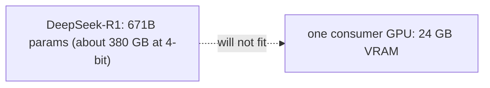
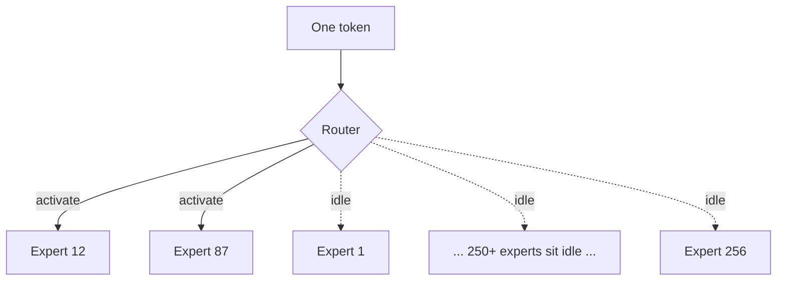
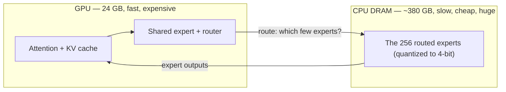
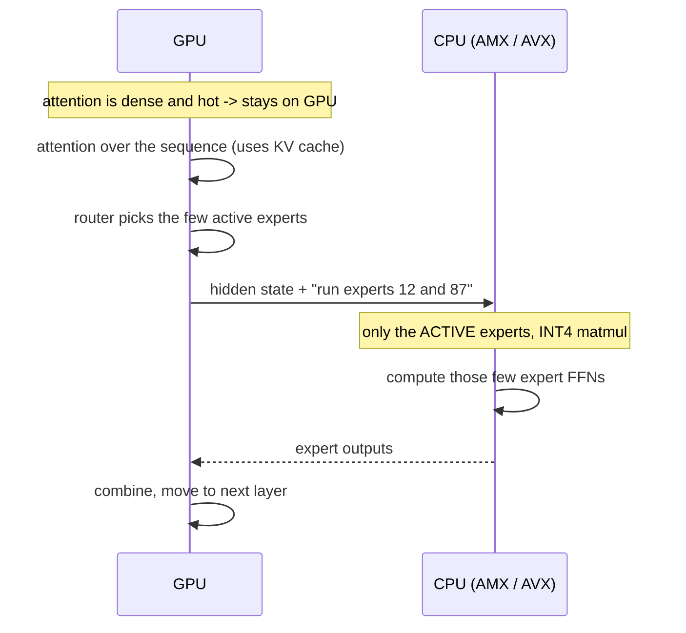
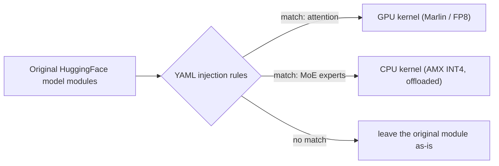

# Note 02 — KTransformers, ELI5: running a 671B model on one gaming GPU

**[← back to the series](./README.md)**

There's a class of open models — DeepSeek-R1/V3, Kimi-K2, GLM — with **671 billion** parameters. To hold one at full precision you'd need well over a terabyte of GPU memory: a rack of data-center cards. Yet [**KTransformers**](https://github.com/wilsonwu-ai/ktransformers) (MADSys Lab @ Tsinghua + Approaching.AI, [SOSP 2025](https://github.com/kvcache-ai/ktransformers)) runs it on **one consumer 24 GB GPU** plus ordinary system RAM — at usable speeds, up to **3–28× faster** than the CPU-only alternative.

This note is the ELI5 of *how*. The whole trick rests on one property of these models, so let's start there.

---

## The problem in one picture

380 GB doesn't go into 24 GB. Game over — unless the model is secretly mostly *idle*.

## The secret: these are Mixture-of-Experts (MoE) models

A dense model runs *all* its weights on every token. A **Mixture-of-Experts** model is different: each layer holds a big committee of "experts" (small feed-forward networks), but a little **router** picks only a **few** of them for each token. DeepSeek-R1 has **256 experts per layer and activates just 8** (plus one always-on shared expert). So of its 671B parameters, only about **37B actually fire** for any given token.

That's the whole opening. **Most of the giant model is dead weight on any single token.** So why pay for the fastest, most expensive memory (GPU VRAM) to store weights that are almost never used?

## The idea: put the hot stuff on the GPU, the cold stuff in cheap RAM

KTransformers splits the model by *how often each piece is used*:

- **On the GPU** goes everything that runs on *every* token and needs speed: attention, the KV cache, the router, the always-on shared expert. Small and hot.
- **In system RAM** go the 256 routed experts — the enormous, rarely-touched pile. RAM is cheap: 384 GB of DDR costs a fraction of the equivalent VRAM, and a normal workstation can hold it.

The analogy: a consulting firm has 256 niche specialists. You don't rent 256 desks in the expensive downtown tower. You keep the specialists in a cheap warehouse and only call in the 2–3 you need for today's client.

## What actually happens per token

The counterintuitive part: **won't the CPU be hopelessly slow?** It isn't, for two reasons:

1. **You only compute a handful of experts per token**, not all 256. The CPU's job is tiny — it's sparse.
2. **Modern CPUs have matrix engines.** Intel **AMX** (Advanced Matrix Extensions) does INT8/INT4 matrix math *in hardware*, and KTransformers ships hand-tuned AMX / AVX-512 kernels. The experts are stored **4-bit quantized**, so each one is small and fast to multiply. Add **NUMA-aware** placement so each CPU socket touches its own memory, and the sparse expert math keeps pace with the GPU's dense attention.

So the two halves run where they're each strongest: **GPU does the dense, latency-critical work; CPU does the big, sparse, quantized work.**

## The clever engineering: an injection framework

KTransformers doesn't fork every model. It uses a **template-based injection system** — you write **YAML rules** that match module paths in the original model and swap them for optimized implementations:

This is the part I find most elegant as a *systems* design: the placement policy (what runs where, in what kernel, at what precision) is **declarative and swappable**, decoupled from the model code. Want to move "hot" experts onto the GPU too if you have spare VRAM? Change a rule. It's the same indirection idea that makes good systems flexible — a mapping layer between "what the model is" and "how it physically runs."

## The memory math, side by side

| | Naive (all on GPU) | KTransformers |
|---|---|---|
| Routed experts (4-bit) | ~350 GB **VRAM** | ~350 GB **system RAM** (cheap) |
| Attention + KV cache + shared | on GPU | on GPU |
| GPU needed | a multi-card server | **one 24 GB card** |
| Bottleneck | you simply can't | CPU expert compute — hidden by sparsity + AMX |

The result the project is famous for: **DeepSeek-R1 (671B) on a single 24 GB GPU + ~380 GB DRAM**, several times faster than running it purely on CPU, and it now feeds these kernels into serving stacks like SGLang.

---

## Why this matters if you build *with* AI

I build products on top of models, and KTransformers reframes a decision I thought was fixed:

- **"Can we self-host the big open model?" isn't a pure GPU-budget question anymore.** For MoE models, the honest question is "how much cheap RAM + one good GPU can we get," which is a *very* different capex line. Sovereignty, privacy, and cost math all shift.
- **Sparsity is a deployment lever, not just a training detail.** MoE was sold as "more parameters for the same compute." KTransformers shows the *other* payoff: sparse activation means most weights can live on slow, cheap memory. If you're choosing a model to self-host, its expert-activation ratio is now an infra spec.
- **Heterogeneous placement is the pattern.** The real lesson is the same one behind [PagedAttention in Note 01](./README.md): match each piece of the workload to the hardware it suits, and put an indirection layer (block tables there, injection rules here) in between so the mapping is flexible. Hot/dense → fast memory; cold/sparse → cheap memory.
- **Know the escape hatch.** When someone says "we need an 8×H100 box to even *try* this model," the right follow-up is: "MoE? Then maybe we need one 4090 and a lot of RAM." Knowing the trick exists changes the conversation — and the budget.

Honest caveat: this shines for **MoE** models with high sparsity and modest concurrency. A *dense* model has no idle experts to banish to RAM, and very high concurrency re-saturates the GPU — different regime, different tool.

---

## Credits & further reading

- **The project:** [kvcache-ai/ktransformers](https://github.com/kvcache-ai/ktransformers) — MADSys Lab @ Tsinghua University, Approaching.AI, 9#AISoft. My fork: [wilsonwu-ai/ktransformers](https://github.com/wilsonwu-ai/ktransformers).
- **The paper:** Chen et al., *KTransformers: Unleashing the Full Potential of CPU/GPU Hybrid Inference for MoE Models*, SOSP 2025.
- **Related:** [Note 01 — How vLLM works](./README.md).

*Field note by [Wilson Wu](https://www.linkedin.com/in/wilson1wu/) — operator learning to build with AI. ELI5 and diagrams are mine, grounded in the project's public docs; corrections welcome. Licensed [CC BY 4.0](https://creativecommons.org/licenses/by/4.0/).*
